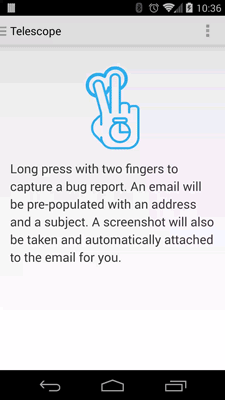

Telescope
======

A simple tool to allow easy bug report capturing within your app.




Usage
-----

Place a `TelescopeLayout` at the root of your hierarchy.

Add a callback to the view group with `setLens(Lens)`. Telescope provides two default
implementations:

* `EmailLens`: Compose an email with the provided addresses and subject (optional).
* `EmailDeviceInfoLens`: Enhances `EmailLens` by pre-populating the email body with app and device
  info

Screenshots will be stored on the external storage in your app's private directory. To have
Telescope clean up the screenshots folder, call `TelescopeLayout.cleanUp(Context)`. Ideally, this
would be called in the `onDestroy()` method of your `Activity` or `Fragment`.

If you are using the Gradle-based build system, you can wrap this view group around your activity
layouts only in the debug builds.

See the [u2020 project][2] for a more advanced example.


Permissions
-----------

Pre-KitKat, `WRITE_EXTERNAL_STORAGE` is required for saving screenshots. Screenshots can be disabled
using the configuration options below.


Configuration
-------------

The view group can be configured as follows:

* Set the number of fingers to trigger with `app:telescope_pointerCount` / `setPointerCount(int)`
* Set the progress color with `app:telescope_progressColor` / `setProgressColor(int)`
* Change the screenshot method with `app:telescope_screenshotMode` /
`setScreenshotMode(ScreenshotMode)`
* Screenshot children only with `app:telescope_screenshotChildrenOnly` /
`setScreenshotChildrenOnly(boolean)`
* Set the screenshot target with`setScreenshotTarget(View)`
* Disable vibration with `app:telescope_vibrate` / `setVibrate(boolean)`


Download
--------

Gradle:
```groovy
compile 'com.mattprecious.telescope:telescope:2.4.0'
```
or Maven:
```xml
<dependency>
  <groupId>com.mattprecious.telescope</groupId>
  <artifactId>telescope</artifactId>
  <version>2.4.0</version>
  <type>apklib</type>
</dependency>
```


License
--------

    Copyright 2014 Matthew Precious

    Licensed under the Apache License, Version 2.0 (the "License");
    you may not use this file except in compliance with the License.
    You may obtain a copy of the License at

       http://www.apache.org/licenses/LICENSE-2.0

    Unless required by applicable law or agreed to in writing, software
    distributed under the License is distributed on an "AS IS" BASIS,
    WITHOUT WARRANTIES OR CONDITIONS OF ANY KIND, either express or implied.
    See the License for the specific language governing permissions and
    limitations under the License.


 [1]: http://repository.sonatype.org/service/local/artifact/maven/redirect?r=central-proxy&g=com.mattprecious.telescope&a=telescope&v=LATEST
 [2]: https://github.com/jakewharton/u2020
